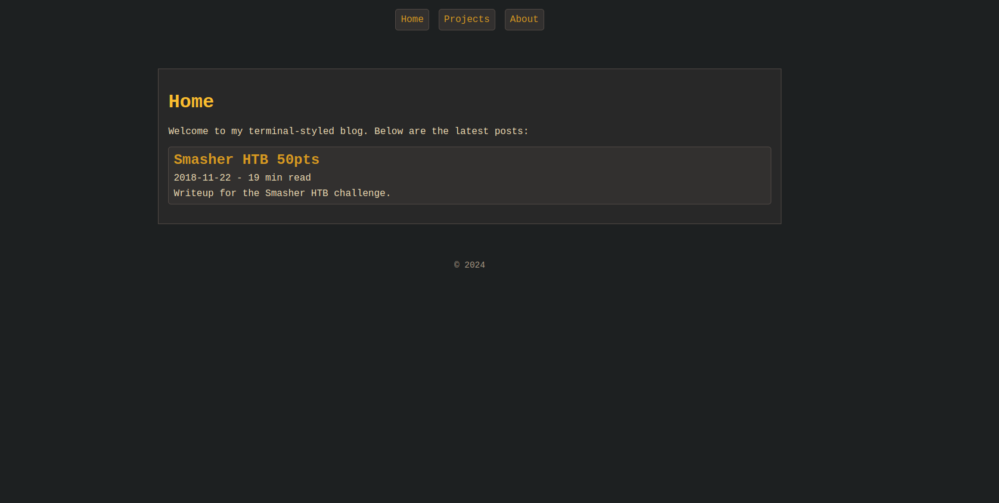

# zola-gruvbox

## Installation

Download theme and place it under themes/

    cd themes/
    git clone https://github.com/spiperac/zola-gruvbox

Set theme in your config.toml

    theme = "zola-gruvbox"

Test it out with:

    zola build
    zola serve
